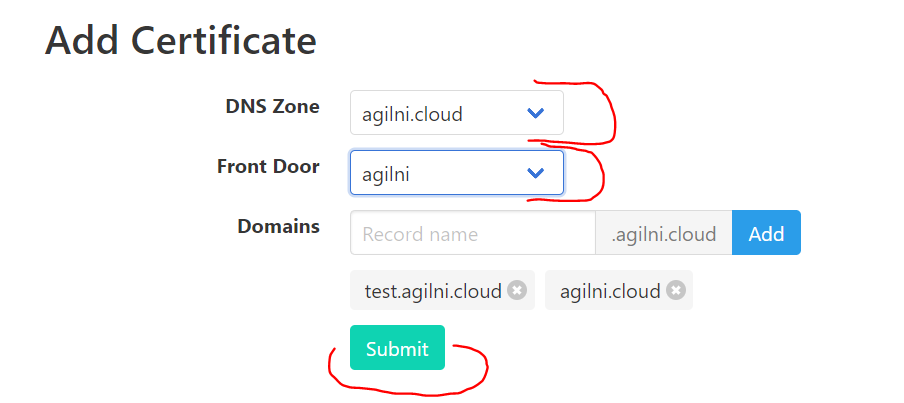

# Key Vault Acmebot

**This project is based on original repository: https://github.com/shibayan/keyvault-acmebot**

This function provide easy automation of Let's Encrypt for Azure Key Vault and Front Door service.

- Store certificates securely with Key Vault
- Centrally manage many certificates with one Key Vault
- Simple deployment and configuration
- Robustness of implementation
- Easy monitoring (Application Insights, Webhook)

Use Key Vault for secure and centralized management of Let's Encrypt certificates.

## Table Of Contents

- [Feature Support](#feature-support)
- [Requirements](#requirements)
- [Getting Started](#getting-started)
- [Usage](#usage)
- [Thanks](#thanks)
- [License](#license)

## Feature Support

- Front Door
- Subject Alternative Names (SANs) certificates (multi-domains support)
- Wildcard certificates

## Requirements

- Azure Subscription
- Azure DNS and Key Vault resource
- Azure Front Door service
- Email address (for Let's Encrypt account)

## Getting Started

### 1. Deploy to Azure Functions

### 2. Add application settings key

- LetsEncrypt:SubscriptionId
  - Azure Subscription Id
- LetsEncrypt:Contacts
  - Email address for Let's Encrypt account
- LetsEncrypt:VaultBaseUrl
  - Azure Key Vault DNS name (Only when using an existing Key Vault)
- LetsEncrypt:KeyVaultId
  - Azure Key Vault Resource Id (Only when using an existing Key Vault)
- LetsEncrypt:Webhook
  - Webhook destination URL (optional, Slack recommend)

### 3. Enable App Service Authentication (EasyAuth) with AAD

Open `Authentication / Authorization` from Azure Portal and turn on App Service Authentication. Then select `Log in with Azure Active Directory` as an action when not logging in.

Set up Azure Active Directory provider by selecting `Express`.

** Additionaly make AAD authentication available only to selected users: switch on `User assigmen required` on AAD Enterprise application generated by Express wizard.  This option you can find in Azure Active Directory - Enterprise Applications - /your AAD application for function/ **

### 4. Assign role to Azure DNS

Assign `DNS Zone Contributor` role to Azure DNS zone or Resource Group.

### 5. Assign role to Azure Front Door

Assign `Network Contributor` role to Front Door or Resource Group.

### 6. Add a access policy for front door to keyvault (created by this deployment or to your own)

Detailed description: https://docs.microsoft.com/en-us/azure/frontdoor/front-door-custom-domain-https#option-2-use-your-own-certificate

In PowerShell, run the following command (once per tenant):
* `New-AzADServicePrincipal -ApplicationId "ad0e1c7e-6d38-4ba4-9efd-0bc77ba9f037"`

Grant Azure Front Door Service permission to access the certificates in your Azure Key Vault account.

* In your key vault account, under SETTINGS, select Access policies, then select Add new to create a new policy.
* In Select principal, search for `ad0e1c7e-6d38-4ba4-9efd-0bc77ba9f037`, and choose `Microsoft.Azure.Frontdoor`. Click Select.
* In `Secret permissions`, select `Get` to allow Front Door to retrieve the certificate.
* In `Certificate permissions`, select `Get` to allow Front Door to retrieve the certificate.
* Select `OK`.
* Azure Front Door Service can now access this Key Vault and the certificates that are stored in this Key Vault.

### 7. Add a access policy (Only when using an existing Key Vault)

Add the created Azure Function to the Key Vault `Certificate management` access policy.

## Usage

### Adding new certificate

Go to `https://YOUR-FUNCTIONS.azurewebsites.net/api/index`. In WebUI you can generate certificates for zone and Front Door. Please in first step select `DNS zone` in second step `Fron Door`. 
Function will add automatically coresponding DNS entries with corresponding Front Door entries for domain.

To work correctly function requires that you have correct entries in Front Door configuration for DNS names which will be used for generating certificates. 
Even if you don't want to switch your domain immediatelly you can use approach with afdverify names - see: https://docs.microsoft.com/en-us/azure/frontdoor/front-door-custom-domain-https#validate-the-domain

If nothing is displayed in the dropdown, the IAM setting is incorrect.

## Thanks

- [ACMESharp Core](https://github.com/PKISharp/ACMESharpCore) by @ebekker
- [Durable Functions](https://github.com/Azure/azure-functions-durable-extension) by @cgillum and contributors
- [DnsClient.NET](https://github.com/MichaCo/DnsClient.NET) by @MichaCo
- https://github.com/shibayan/keyvault-acmebot by @shibayan

## License

This project is licensed under the Apache License 2.0
